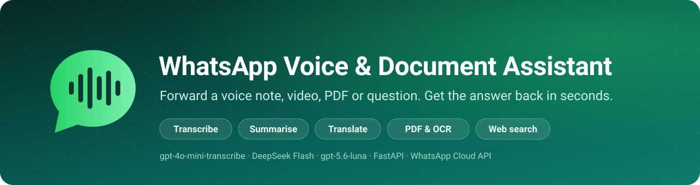
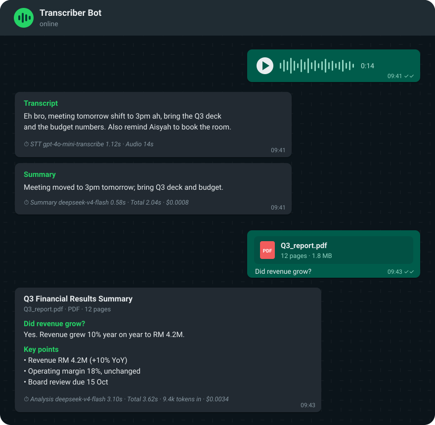
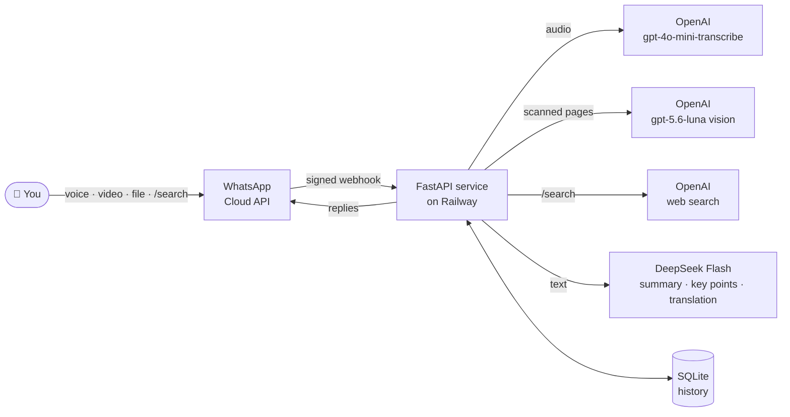

<p align="center">
  
</p>

<p align="center">
  <a href="https://github.com/kwincheah/whatsapp_transcript_service/actions/workflows/tests.yml"></a>
  
  
  
  
  <a href="LICENSE"></a>
</p>

<p align="center">
  <b>A personal WhatsApp bot that turns voice notes, videos and documents into text you can skim.</b><br>
  It transcribes, summarises, translates, reads scanned PDFs and searches the web,<br>
  and every reply shows the model, the latency and the cost.
</p>

<p align="center">
  <a href="#-quick-start"><b>Quick start</b></a> ·
  <a href="docs/USAGE.md"><b>Usage</b></a> ·
  <a href="docs/SETUP.md"><b>Setup guide</b></a> ·
  <a href="docs/CONFIGURATION.md"><b>Configuration</b></a> ·
  <a href="docs/ARCHITECTURE.md"><b>Architecture</b></a> ·
  <a href="docs/TROUBLESHOOTING.md"><b>Troubleshooting</b></a>
</p>

---

## ✨ Highlights

<table>
  <tr>
    <td width="33%" valign="top">
      <h3>🎙️ Voice → text</h3>
      Voice notes, audio files and videos are transcribed in about a second. The transcript arrives <b>first</b>; the summary follows in a second message.
    </td>
    <td width="33%" valign="top">
      <h3>💡 Summaries by length</h3>
      A one-line summary for notes over 8 s. <b>Key points</b>, with action items and dates first, for notes over 60 s.
    </td>
    <td width="33%" valign="top">
      <h3>🌐 Translation</h3>
      <code>/lang English</code> translates notes in any language. Mixed Malay, English and Chinese is fine.
    </td>
  </tr>
  <tr>
    <td valign="top">
      <h3>📄 Documents & OCR</h3>
      PDF, Word and text files get a title, summary and key points. Scanned pages are <b>OCR'd</b>. Add a caption to ask a question about the file.
    </td>
    <td valign="top">
      <h3>🔎 Web search</h3>
      <code>/search your question</code> returns a short, current answer with numbered source links.
    </td>
    <td valign="top">
      <h3>⏱️ Transparent</h3>
      Every reply shows the model, the time taken and the estimated cost. <code>/stats</code> and <code>/find</code> cover your history.
    </td>
  </tr>
</table>

## 📱 See it in action

<p align="center">
  
</p>

## 📥 What you can send

| Send | You get back |
|---|---|
| 🎙️ **Voice note / audio file / video** | 📝 Transcript, then 💡 summary (over 8 s), 📌 key points (over 60 s) and 🌐 translation (with `/lang`) |
| 📄 **PDF · Word · text file** | Title, 💡 summary and 📌 key points; a caption on the file is answered as a question (❓) |
| 🔍 **Scanned PDF** | Pages without a text layer are read by a vision model, then summarised |
| 💬 **`/search` question** | A short web answer with sources |

## ⌨️ Commands

| Command | What it does |
|---|---|
| `/search <question>` | Search the web |
| `/find <keyword>` | Search your past transcripts, documents and searches |
| `/lang <language>` · `/lang off` | Translate into a language, or stop translating |
| `/vocab add A, B` · `/vocab list` · `/vocab clear` | Words the transcriber should spell correctly |
| `/stats` | Usage, audio minutes, average latency and cost |
| `/help` | Everything above, inside WhatsApp |

More examples: **[docs/USAGE.md](docs/USAGE.md)**.

## 🚀 Quick start

> **You need:** a Meta developer app with WhatsApp (its free test number is enough), an OpenAI API key, a DeepSeek API key and a Railway account.

**1. Deploy.** In Railway, choose **New Project → Deploy from GitHub** and pick this repo. It builds from the `Dockerfile`.

**2. Configure.** Use the CLI, because the web editor has been seen truncating long values:
```bash
railway variables --set "WHATSAPP_TOKEN=EAA..." \
                  --set "WHATSAPP_PHONE_NUMBER_ID=1234567890123456" \
                  --set "WHATSAPP_VERIFY_TOKEN=any-random-string" \
                  --set "WHATSAPP_APP_SECRET=<32-char app secret>" \
                  --set "ALLOWED_SENDERS=60123456789" \
                  --set "OPENAI_API_KEY=sk-..." \
                  --set "DEEPSEEK_API_KEY=sk-..."
```

**3. Persist history.** Attach a Railway **volume** at `/app/data`.

**4. Connect WhatsApp.** In Meta, set the webhook to `https://<your-domain>/webhook`, subscribe to **`messages`**, then link the app to your WhatsApp account:
```bash
curl -X POST "https://graph.facebook.com/v23.0/<WABA_ID>/subscribed_apps" \
  -H "Authorization: Bearer <WHATSAPP_TOKEN>"
```

**5. Say hi.** Send `/help` to the bot, then forward it a voice note. 🎉

📖 Full step-by-step walkthrough: **[docs/SETUP.md](docs/SETUP.md)** · ⚙️ All options: **[docs/CONFIGURATION.md](docs/CONFIGURATION.md)**

## 🏗️ How it works



| Layer | Technology |
|---|---|
| Messaging | WhatsApp Cloud API (official, so your personal account is never automated) |
| Service | Python 3.12, FastAPI, httpx, Docker on Railway |
| Speech-to-text | OpenAI `gpt-4o-mini-transcribe`, with custom vocabulary |
| Analysis | DeepSeek Flash in JSON mode with thinking off, and a separate token budget per task |
| OCR & web search | OpenAI `gpt-5.6-luna` (vision + `web_search` tool) |
| Documents | `pypdf`, `python-docx`, `pypdfium2` |
| History | SQLite + FTS5, private per user |

Design notes, token budgets and the code layout: **[docs/ARCHITECTURE.md](docs/ARCHITECTURE.md)**.

## 💰 Typical cost

| Action | ≈ Cost |
|---|---|
| 1-minute voice note (transcript + summary) | **$0.004** |
| 20-page PDF summary | **$0.005** |
| Scanned page (OCR) | **$0.001–0.002** |
| Web search | **$0.01–0.02** |

Replies on WhatsApp are free within the 24-hour window that your message opens. The cost model is in [docs/CONFIGURATION.md](docs/CONFIGURATION.md#-costs).

## 📚 Documentation

| Guide | Contents |
|---|---|
| [**Usage & examples**](docs/USAGE.md) | Every input type, sample replies, all commands |
| [**Setup guide**](docs/SETUP.md) | Meta → Railway → webhook → test → permanent token, plus local development |
| [**Configuration**](docs/CONFIGURATION.md) | Every environment variable, token budgets, prices |
| [**Architecture**](docs/ARCHITECTURE.md) | Message flow, design decisions, project structure, security & privacy |
| [**Troubleshooting**](docs/TROUBLESHOOTING.md) | Log line → cause → fix |

## 🧪 Development

```bash
python -m venv .venv && source .venv/bin/activate
pip install -r requirements-dev.txt
pytest                                   # no API keys or network needed
uvicorn app.main:app --reload --port 8000
```

## 🗺️ Roadmap

<details>
<summary><b>Shipped</b>: transcription, summaries, key points, translation, vocabulary, documents, OCR, web search, history, stats</summary>

- [x] Two-stage replies (transcript first)
- [x] Summaries over 8 s and key points over 60 s
- [x] Translation (`/lang`) and custom vocabulary (`/vocab`)
- [x] Audio files, videos, PDF, Word and text documents, with caption questions
- [x] OCR for scanned PDFs
- [x] Web search (`/search`)
- [x] History search (`/find`), `/stats`, per-reply cost

</details>

**Next up**

- [ ] 📷 **Photos** of documents, receipts and whiteboards, reusing the OCR pipeline
- [ ] 💬 **Follow-up questions**: reply to any bot message to ask about that note or document
- [ ] ⏰ **Reminders**: turn dated action items into calendar invites
- [ ] 📊 **Excel & PowerPoint** support
- [ ] 📚 **Very long documents & audio**: section-by-section summaries and chunked transcription
- [ ] 🗑️ **Retention**: auto-delete old history, plus `/forget`

## 📄 License

[MIT](LICENSE) © 2026 Cheah Ken Win

---

<p align="center">
  <sub>Built with FastAPI · OpenAI · DeepSeek · WhatsApp Cloud API · Railway</sub>
</p>
