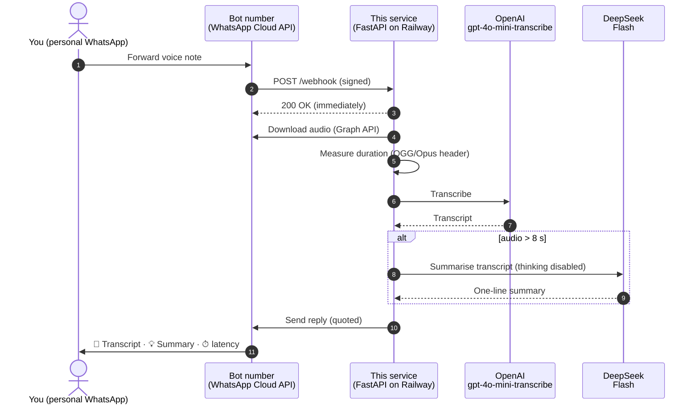

<div align="center">

# 🎙️ WhatsApp Voice Transcriber

**Forward a voice note to your bot and get the transcript back in about two seconds.**
**Long messages also come with a one-line summary.**


</div>

---

## Contents

- [Features](#-features)
- [What a reply looks like](#-what-a-reply-looks-like)
- [How it works](#-how-it-works)
- [Quick start](#-quick-start)
- [Full setup guide](#-full-setup-guide)
  - [1. Meta / WhatsApp](#1-meta--whatsapp)
  - [2. Deploy on Railway](#2-deploy-on-railway)
  - [3. Connect the webhook](#3-connect-the-webhook)
  - [4. Test it](#4-test-it)
  - [5. Make it permanent](#5-make-it-permanent)
- [Configuration](#-configuration)
- [Troubleshooting](#-troubleshooting)
- [Running locally](#-running-locally)
- [Project structure](#-project-structure)
- [Security & privacy](#-security--privacy)
- [Costs](#-costs)
- [Roadmap](#-roadmap)

---

## ✨ Features

| | |
|---|---|
| 📝 **Transcription** | Every voice note is transcribed with OpenAI **`gpt-4o-mini-transcribe`** |
| 💡 **Smart summary** | Audio **longer than 8 s** also gets a one-line summary from **DeepSeek Flash**, in the same language as the speaker |
| ⏱️ **Latency & model info** | Every reply shows which model ran each step, how long each step took, the end-to-end total, and the audio length |
| 🔒 **Private by default** | Only numbers in `ALLOWED_SENDERS` get replies, and webhook signatures are checked against your Meta app secret |
| 🛡️ **Resilient** | Meta's retries are de-duplicated. A failed summary never hides the transcript. API errors are logged with Meta's or the provider's own message |
| ✅ **Official API** | Runs on Meta's WhatsApp Cloud API, and your personal WhatsApp account is never automated |

---

## 💬 What a reply looks like

**Voice note longer than 8 seconds**

```text
📝 Transcript
Hey, just wanted to let you know the meeting moved to 3pm tomorrow,
and can you bring the Q3 deck and the updated budget numbers? Thanks!

💡 Summary
Meeting moved to 3pm tomorrow; bring Q3 deck and budget.

⏱ STT gpt-4o-mini-transcribe 1.42s · Summary deepseek-v4-flash 0.61s · Total 2.31s · Audio 14s
```

**Voice note of 8 seconds or less**

```text
📝 Transcript
On my way, see you in ten.

⏱ STT gpt-4o-mini-transcribe 0.88s · Total 1.21s · Audio 4s
```

> [!NOTE]
> - **Total** is end to end: download from WhatsApp, then transcription, then the summary.
> - If the summary step fails, you still get the full transcript, with `💡 Summary (unavailable)`, and the reason goes to the logs.
> - The bot replies as a **quote** of your voice note, so it's clear which note each transcript belongs to.

---

## 🧭 How it works



**Key details**

- **The bot is a separate number.** You message it from your normal WhatsApp like any contact. A number can't message itself, and a number registered on the Cloud API stops working in the WhatsApp app, so **never use your personal number as the bot**.
- **The webhook answers straight away.** It returns `200` immediately and does the processing in the background, which stops Meta from retrying and sending duplicates.
- **Duration** comes from the audio file's own header, read with `mutagen`. If that isn't possible, the bot estimates from the transcript at about 2.5 words per second.
- **DeepSeek's thinking mode is turned off** for summaries. DeepSeek's API reasons by default, which is slower and can use up the token budget before any summary is written.
- **The reply goes out from whichever bot number received the message**, taken from the webhook payload. A mistyped `WHATSAPP_PHONE_NUMBER_ID` can't break replies.

---

## 🚀 Quick start

Already familiar with Meta apps and Railway? This is the short version:

```bash
# 1. Deploy this repo on Railway (it builds from the Dockerfile)
# 2. Set the variables (the CLI avoids the web editor truncating long values)
railway variables --set "WHATSAPP_TOKEN=EAA..." \
                  --set "WHATSAPP_PHONE_NUMBER_ID=1234567890123456" \
                  --set "WHATSAPP_VERIFY_TOKEN=some-random-string" \
                  --set "WHATSAPP_APP_SECRET=0123456789abcdef0123456789abcdef" \
                  --set "ALLOWED_SENDERS=60123456789" \
                  --set "OPENAI_API_KEY=sk-..." \
                  --set "DEEPSEEK_API_KEY=sk-..."
# 3. Meta webhook → https://<your-domain>/webhook, subscribe to "messages"
# 4. Connect the app to your WhatsApp Business Account
curl -X POST "https://graph.facebook.com/v23.0/<WABA_ID>/subscribed_apps" \
  -H "Authorization: Bearer <WHATSAPP_TOKEN>"
```

Then send "hi" to the bot, and forward it a voice note.

---

## 📖 Full setup guide

### 1. Meta / WhatsApp

1. Go to **[developers.facebook.com](https://developers.facebook.com) → My Apps → Create App**, choose **"Connect with customers through WhatsApp"** (or type *Business*), and add the **WhatsApp** product.
2. Open **WhatsApp → API Setup**:
   - Meta gives you a free **test number** (e.g. `+1 555 …`). **That's all you need for personal use.**
   - Under **To → Manage phone number list**, add **your personal number** and confirm it with the code WhatsApp sends.
   - Note down the **Phone number ID** and the **WhatsApp Business Account ID (WABA ID)**. These are long numeric IDs, *not* phone numbers.
3. Go to **App settings → Basic** and copy the **App secret** (32 characters).
4. **Optional, recommended:** set **App Mode** to **Live**. This needs a Privacy Policy URL and a category under *App settings → Basic*. In Development mode, some setups only receive the dashboard's test events.

> [!WARNING]
> Don't click **"Add phone number"** with your **personal** number. Registering it on the Cloud API removes it from the WhatsApp app.

### 2. Deploy on Railway

1. Go to **[railway.com](https://railway.com) → New Project → Deploy from GitHub repo** and pick this repository. Railway builds it from the `Dockerfile`. The first deploy fails until the variables are set, which is expected.
2. **Set the variables** (see [Configuration](#-configuration)). Use the **Railway CLI**, because the web editor has been seen truncating long values such as tokens and IDs:
   ```bash
   npm i -g @railway/cli && railway login && railway link
   railway variables --set "WHATSAPP_TOKEN=EAA..."
   # ...repeat for each variable, then verify:
   railway variables --kv
   ```
3. **Create a public URL.** Click the **service box** on the canvas, then open **Settings → Networking → Generate Domain**. This is the *service's* Settings, not the project's; the project Settings only shows a "Webhooks" tab, which is unrelated. If it asks for a port, use the one in the deploy log line `Uvicorn running on http://0.0.0.0:<PORT>`.
4. Open `https://<your-domain>/health` in a browser. It should show `{"ok":true}`.
5. Check the startup log line. It prints lengths only, never secret values:
   ```text
   config: phone_number_id=1329315093600329 token_len=212 app_secret_len=32 allowed=['60123456789']
   ```
   If a length looks too short, that value was truncated.

### 3. Connect the webhook

1. **Test the verify token** in a browser, pasting your token between `verify_token=` and `&hub.challenge`:
   ```text
   https://<your-domain>/webhook?hub.mode=subscribe&hub.verify_token=<YOUR_TOKEN>&hub.challenge=hello
   ```
   The page should show `hello`. A `403` means the token doesn't match, and a `422` means part of the URL is missing, usually the `&`.
2. In Meta, open **WhatsApp → Configuration → Webhook → Edit**:
   | Field | Value |
   |---|---|
   | Callback URL | `https://<your-domain>/webhook` |
   | Verify token | Same as `WHATSAPP_VERIFY_TOKEN` (no quotes) |

   Click **Verify and save**, then under **Webhook fields**, **subscribe to `messages`**.
3. **Connect the app to your WhatsApp Business Account.** Real messages won't arrive without this step:
   ```bash
   curl -X POST "https://graph.facebook.com/v23.0/<WABA_ID>/subscribed_apps" \
     -H "Authorization: Bearer <WHATSAPP_TOKEN>"
   # → {"success": true}
   ```
   To confirm, run `GET <WABA_ID>/phone_numbers` in the [Graph API Explorer](https://developers.facebook.com/tools/explorer). The test number should show your webhook URL under `webhook_configuration`.

### 4. Test it

| Step | Expected result |
|---|---|
| Send **"hi"** to the bot's number | *"Forward me a voice message and I'll transcribe it."* |
| Forward a voice note **≤ 8 s** | 📝 Transcript + ⏱ latency line |
| Forward a voice note **> 8 s** | 📝 Transcript + 💡 Summary + ⏱ latency line |

Each voice note logs a line like:
```text
done audio=14.2s stt=1.31s summary=0.58s total=2.07s
```

### 5. Make it permanent

The token on the API Setup page **expires after 24 hours**, and the bot silently stops replying when it does. Replace it with a permanent **System User** token:

1. **[business.facebook.com](https://business.facebook.com) → Settings → Users → System users → Add**, with role *Admin*.
2. **Assign assets**: your **app** and your **WhatsApp account**, both with *Full control*.
3. **Generate token**: pick your app, set expiration to **Never**, and select the permissions `whatsapp_business_messaging` and `whatsapp_business_management`.
4. `railway variables --set "WHATSAPP_TOKEN=EAA..."`

---

## ⚙️ Configuration

All settings come from environment variables: Railway **Variables**, or a local `.env` file (see [`.env.example`](.env.example)).
Enter the **value only**, with no quotes, spaces or trailing comments.

### Required

| Variable | Where to find it | Looks like |
|---|---|---|
| `WHATSAPP_TOKEN` | System User token (see [step 5](#5-make-it-permanent)) | `EAA…` (~200 chars) |
| `WHATSAPP_PHONE_NUMBER_ID` | WhatsApp → API Setup → *Phone number ID* | `1329315093600329` |
| `WHATSAPP_VERIFY_TOKEN` | **You make it up**; enter the same value in Meta | `kc-wa-bot-7x92f` |
| `OPENAI_API_KEY` | [platform.openai.com](https://platform.openai.com/api-keys) | `sk-proj-…` |
| `DEEPSEEK_API_KEY` | [platform.deepseek.com](https://platform.deepseek.com/api_keys) | `sk-…` |

### Recommended

| Variable | Default | Description |
|---|---|---|
| `WHATSAPP_APP_SECRET` | *(empty: check off)* | App settings → Basic → App secret (32 chars). Rejects forged webhook calls |
| `ALLOWED_SENDERS` | *(empty: anyone)* | Comma-separated numbers with country code, no `+`, e.g. `601117601859`. Everyone else is ignored |

### Optional tuning

| Variable | Default | Description |
|---|---|---|
| `STT_MODEL` | `gpt-4o-mini-transcribe` | OpenAI transcription model (`gpt-4o-transcribe` is more accurate but slower and pricier) |
| `SUMMARY_MODEL` | `deepseek-v4-flash` | DeepSeek model. At the time of writing, DeepSeek routes this name to V4.1 Flash; `deepseek-flash` names the latest Flash directly |
| `SUMMARY_MIN_SECONDS` | `8` | Summarise only when the audio is **longer** than this |
| `SUMMARY_MAX_TOKENS` | `400` | Token budget for the summary call. The prompt already keeps the output to one short sentence |
| `SUMMARY_THINKING` | `false` | DeepSeek reasoning mode. Leave it off; if you turn it on, raise `SUMMARY_MAX_TOKENS` to about 1000 |
| `DEEPSEEK_BASE_URL` | `https://api.deepseek.com` | Override for a proxy or a compatible provider |
| `WHATSAPP_API_VERSION` | `v23.0` | Meta Graph API version |

---

## 🩺 Troubleshooting

Almost every problem shows up in the **Railway logs** (service → *Deployments* → *View Logs*). Send a message to the bot and watch what appears.

| Symptom / log line | Cause | Fix |
|---|---|---|
| **No `POST /webhook`** when you message the bot | Meta isn't forwarding to you | Subscribe to `messages`, run the `subscribed_apps` call (step 3.3), check you used the **test number's** WABA ID, or switch the app to **Live** |
| `GET /webhook … 422` | Test URL malformed | Make sure there's a `&` before `hub.challenge` |
| `GET /webhook … 403` | Verify token mismatch | Use the same value in Railway and Meta, without quotes |
| `POST /webhook … 401` | App secret wrong or truncated | Copy it again from **App settings → Basic**; it must be exactly 32 characters |
| `ignoring message from non-allowed sender N` | `ALLOWED_SENDERS` mismatch | Set it to exactly `N`. `16315551181` is Meta's **dashboard test** sender, not you |
| `Graph API 401 … Session has expired` | 24 h temporary token | Create a permanent token ([step 5](#5-make-it-permanent)) |
| `Graph API 400 … Object with ID '…' does not exist` | Wrong or truncated phone number ID | Replies use the ID from the webhook payload, but check `WHATSAPP_PHONE_NUMBER_ID` too |
| `Graph API 400 … 131030` | Your number isn't allowed as a recipient | Add it under **API Setup → To** |
| `empty summary … finish_reason=length` | DeepSeek spent the budget reasoning | Keep `SUMMARY_THINKING=false`, or raise `SUMMARY_MAX_TOKENS` |
| `summary failed` + `401` / `402` | DeepSeek key wrong / no balance | Fix the key or top up |
| `failed to process` + OpenAI error | OpenAI key wrong / no credit | Fix the key or add credit |
| The bot worked yesterday, but not today | Temporary token expired | [Step 5](#5-make-it-permanent) |

> [!TIP]
> Messages sent back while you're in a **customer-service window** are free-form. That window is the 24 hours after *you* last messaged the bot, and forwarding a voice note opens it, so replies always work.

---

## 💻 Running locally

```bash
git clone https://github.com/kwincheah/whatsapp_transcript_service.git
cd whatsapp_transcript_service

python -m venv .venv && source .venv/bin/activate   # Windows: .venv\Scripts\activate
pip install -r requirements-dev.txt

cp .env.example .env        # then fill it in
uvicorn app.main:app --reload --port 8000

# In another terminal, expose it to Meta:
ngrok http 8000             # use https://<id>.ngrok-free.app/webhook as the Callback URL
```

Run the tests (they use fakes, so no API keys or network are needed):

```bash
pytest
```

Or run it with Docker:

```bash
docker build -t wa-transcriber .
docker run --env-file .env -p 8000:8000 wa-transcriber
```

---

## 🗂️ Project structure

```text
.
├── app/
│   ├── main.py        # FastAPI app: webhook verify/receive, allow-list, dedupe, background handling
│   ├── pipeline.py    # Transcribe → (summarise if > N s) → format the reply
│   ├── ai.py          # OpenAI STT + DeepSeek summary clients, with timing
│   ├── whatsapp.py    # Graph API: download media, send reply, verify webhook signature
│   ├── audio.py       # Audio duration from the file header (mutagen)
│   └── config.py      # Settings from environment variables
├── tests/             # pytest suite (pipeline, webhook, signature, DeepSeek params)
├── Dockerfile         # Used by Railway
├── .env.example       # Template for all variables
└── requirements*.txt
```

**Endpoints**

| Method | Path | Purpose |
|---|---|---|
| `GET` | `/health` | Liveness check → `{"ok": true}` |
| `GET` | `/webhook` | Meta's verification handshake |
| `POST` | `/webhook` | Incoming WhatsApp messages |

---

## 🔐 Security & privacy

- **Secrets stay out of git.** `.env` is git-ignored, and the startup log prints secret **lengths** only.
- **Webhook signatures are checked.** With `WHATSAPP_APP_SECRET` set, every `POST /webhook` must carry a valid `X-Hub-Signature-256`.
- **An allow-list protects your credits.** With `ALLOWED_SENDERS` set, strangers who find the bot number get no response.
- **Nothing is stored.** Audio and transcripts exist only in memory while a message is processed. They are sent to OpenAI (audio) and DeepSeek (transcript text) under those providers' data policies.
- **Leaked keys:** revoke them in the provider's dashboard right away and set new ones.

---

## 💰 Costs

| Component | Cost |
|---|---|
| WhatsApp Cloud API | Replies inside the 24 h customer-service window are free under Meta's current pricing |
| OpenAI `gpt-4o-mini-transcribe` | Billed per minute of audio; a fraction of a cent per voice note |
| DeepSeek Flash | Billed per token; a one-line summary with thinking off costs very little |
| Railway | Trial credit, then the Hobby plan |

Check each provider's pricing page for current rates.

---

## 🗺️ Roadmap

Ideas for next steps, roughly in order of value for effort:

- [ ] **Translation.** Add the translation to English (or a chosen language) when the voice note is in another language.
- [ ] **Key points for long notes.** Voice notes over about 60 s get 3–5 bullet points or action items instead of one line.
- [ ] **Two-stage reply.** Send the transcript first and the summary as a second message, so it feels faster.
- [ ] **Custom vocabulary.** Pass names and jargon to the transcription model's `prompt` so they're spelled correctly.
- [ ] **More input types.** Handle audio files sent as documents, and video notes.
- [ ] **Chat commands.** `/stats` (usage, latency, cost this month) and `/lang ms` (preferred language).
- [ ] **Searchable history.** An optional SQLite store and `/search <keyword>` across past transcripts.
- [ ] **Per-message cost** in the ⏱ line.
