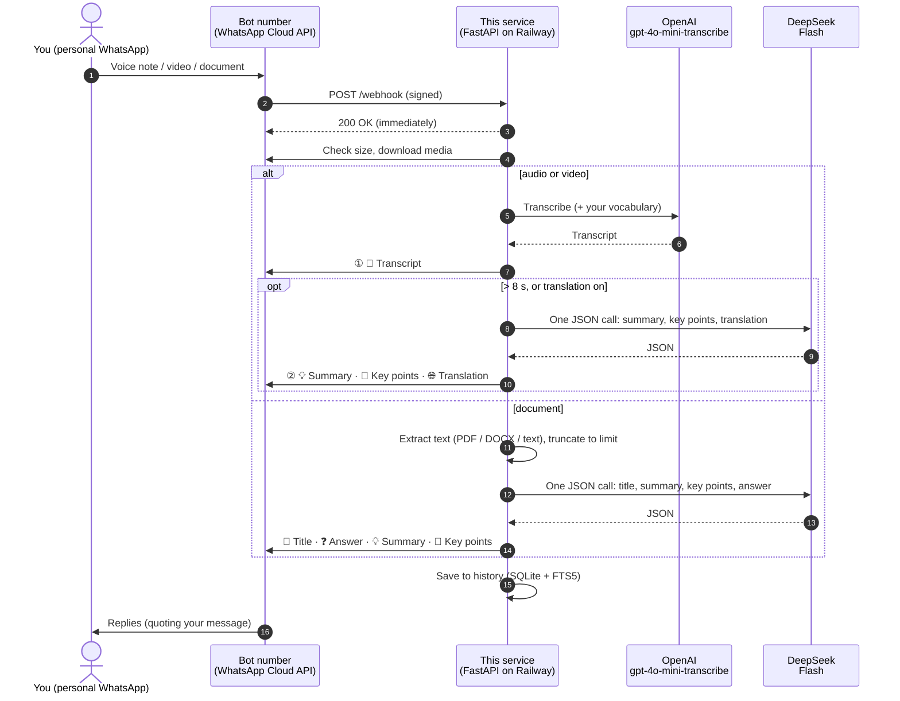

<div align="center">

# 🎙️ WhatsApp Voice & Document Assistant

**Forward a voice note, video or document to your bot.**
**Get a transcript, summary, key points and translation back on WhatsApp, with the latency and cost of every reply.**


</div>

---

## Contents

- [Features](#-features)
- [What replies look like](#-what-replies-look-like)
- [Commands](#-commands)
- [How it works](#-how-it-works)
- [Token budgets](#-token-budgets)
- [Quick start](#-quick-start)
- [Full setup guide](#-full-setup-guide)
- [Configuration](#-configuration)
- [Troubleshooting](#-troubleshooting)
- [Running locally](#-running-locally)
- [Project structure](#-project-structure)
- [Security & privacy](#-security--privacy)
- [Costs](#-costs)
- [Roadmap](#-roadmap)

---

## ✨ Features

| | |
|---|---|
| 📝 **Transcription** | Voice notes, audio files (mp3, m4a, wav, ogg…) and videos are transcribed with OpenAI **`gpt-4o-mini-transcribe`** |
| ⚡ **Two-stage replies** | The transcript is sent **as soon as it's ready**. The summary, key points and translation follow in a second message |
| 💡 **Summaries by length** | Audio **> 8 s** gets a one-line summary. Audio **> 60 s** also gets 3–5 **key points**, with action items and dates first |
| 🌐 **Translation** | `/lang English` (any language) adds a full translation when a note is in another language, and document summaries are written in that language |
| 📄 **Document analysis** | **PDF, Word (.docx) and text files** (txt, md, csv, json…) get a title, summary and key points. **Add a caption to ask a question** about the file |
| 🔤 **Custom vocabulary** | `/vocab add Kwin, Petronas` helps the transcriber spell names and jargon correctly |
| ⏱️ **Latency, model & cost** | Every reply shows each step's model and time, the end-to-end total, and the **estimated cost** |
| 🔎 **History** | `/search` past transcripts and documents; `/stats` shows usage, average latency and spend |
| 🔒 **Private by default** | Sender allow-list, webhook signature checks, and history kept separate per user |
| 🛡️ **Resilient** | De-duplicated retries, a failed analysis never hides the transcript, long replies are split automatically, and oversized files are rejected before downloading |

---

## 💬 What replies look like

### 🎙️ Voice note, 14 s (over 8 s → summary)

```text
📝 Transcript
Eh bro, meeting tomorrow shift to 3pm ah, bring the Q3 deck and budget numbers.

⏱ STT gpt-4o-mini-transcribe 1.12s · Audio 14s
```
```text
💡 Summary
Meeting moved to 3pm tomorrow; bring Q3 deck and budget.

⏱ Summary deepseek-v4-flash 0.58s · Total 2.04s · $0.0008
```

### 🎙️ Voice note, 95 s, with `/lang English` (over 60 s → key points)

```text
📝 Transcript
Hari ni kita kena finalise vendor list sebelum Jumaat…

⏱ STT gpt-4o-mini-transcribe 2.40s · Audio 1m 35s
```
```text
💡 Summary
Finalise the vendor list before Friday and send quotes to finance.

📌 Key points
• Finalise vendor list by Friday
• Send the three quotes to finance
• Book the venue for 12 Oct

🌐 Translation (English)
Today we need to finalise the vendor list before Friday…

⏱ Summary deepseek-v4-flash 1.90s · Total 4.71s · $0.0061
```

### 🎙️ Voice note, 4 s (8 s or less → transcript only)

```text
📝 Transcript
On my way, see you in ten.

⏱ STT gpt-4o-mini-transcribe 0.81s · Audio 4s · Total 1.20s · $0.0002
```

### 📄 PDF with the caption *"Did revenue grow?"*

```text
📄 Q3 Financial Results Summary
Q3_report.pdf · PDF · 12 pages

❓ Did revenue grow?
Yes. Revenue grew 10% year on year to RM 4.2M.

💡 Summary
The report covers Q3 performance: revenue up 10%, margins stable, and a cost-reduction plan for Q4.

📌 Key points
• Revenue RM 4.2M (+10% YoY)
• Operating margin 18%, unchanged
• Q4 target: cut logistics costs by 5%
• Board review due 15 Oct

⏱ Extract 0.21s · Analysis deepseek-v4-flash 3.10s · Total 3.62s · 9.4k tokens in · $0.0034
```

> [!NOTE]
> - **Total** is end to end: download, extraction or transcription, then analysis. Costs are **estimates** from token usage and your configured prices.
> - Replies **quote** your original message, so it's clear which reply belongs to which file.
> - Documents with more than about 8k tokens of text get a quick *"📄 Reading…"* message first. Documents over `DOC_MAX_INPUT_CHARS` are truncated, and the reply says what share was analysed.
> - Replies over WhatsApp's 4,096-character limit are split into numbered parts, e.g. `(1/3)`.

**Supported inputs**

| Send | What happens |
|---|---|
| 🎙️ Voice note | Transcript (+ summary / key points / translation) |
| 🎬 Video | The audio track is transcribed the same way |
| 🎵 Audio file (as a document) | mp3, m4a, wav, ogg, flac, webm |
| 📄 PDF | Text is extracted and analysed; a caption becomes a question |
| 📝 Word `.docx` | Paragraphs and tables are extracted and analysed |
| 🗒️ Text files | txt, md, csv, tsv, json, xml, yaml, html, srt, vtt |
| 📷 Image, scanned PDF, zip… | A polite "not supported yet" message ([roadmap](#-roadmap)) |

---

## ⌨️ Commands

Send these as normal WhatsApp messages to the bot:

| Command | What it does |
|---|---|
| `/help` | Shows what the bot can do |
| `/lang English` | Translates voice notes into English (any language name works) and writes document summaries in it. `/lang off` stops it, and `/lang` shows the current setting |
| `/vocab add Kwin, Petronas, KLCC` | Adds words for the transcriber to spell correctly (up to 100 per user) |
| `/vocab list` · `/vocab clear` | Shows or clears your vocabulary |
| `/search vendor quote` | Searches your past transcripts and documents; all words must match |
| `/stats` | Shows counts, audio minutes, average latency and estimated cost for the last 30 days and all time |

Commands that use history need `DB_PATH` enabled (the default). On Railway, add a **volume** so history survives redeploys ([step 2.4](#2-deploy-on-railway)).

---

## 🧭 How it works



**Design notes**

- **Speed:**
  - The transcript goes out before any analysis starts.
  - All analysis happens in **one** DeepSeek call that returns JSON.
  - DeepSeek's thinking mode is **disabled**, since it's slower and burns output tokens on hidden reasoning.
- **Audio length** is read from the file header (`mutagen`). If that fails, it's estimated from the transcript at about 2.5 words per second.
- **The bot is a separate number.** You message it like any contact. Never register your personal number as the bot, because it would stop working in the WhatsApp app.
- **Replies go out from the number that received the message**, taken from the webhook payload. A mistyped `WHATSAPP_PHONE_NUMBER_ID` can't break them.

---

## 🎯 Token budgets

Each task has its own output budget. Thinking is off, so the whole budget goes to the visible answer:

| Task | Output budget | Setting |
|---|---|---|
| Voice summary (1 sentence) | **150** tokens | `VOICE_SUMMARY_MAX_TOKENS` |
| Voice key points (3–5 bullets) | **+350** tokens | `VOICE_KEY_POINTS_MAX_TOKENS` |
| Voice translation | **≈ 1.5 × transcript tokens + 100**, capped at **4,000** | `TRANSLATION_MAX_TOKENS` |
| JSON overhead (voice) | **+50** tokens | — |
| Document title + summary + key points + answer | **1,500** tokens | `DOC_MAX_OUTPUT_TOKENS` |

And on the input side:

| Limit | Default | Setting |
|---|---|---|
| Document text sent to the model | **150,000 chars** (≈ 40k tokens); longer documents are truncated | `DOC_MAX_INPUT_CHARS` |
| Document file size | **20 MB** | `DOC_MAX_BYTES` |
| Audio/video file size | **25 MB** (OpenAI's upload limit) | `STT_MAX_BYTES` |

Examples: a 14 s note gets `50 + 150 = 200` tokens. A 95 s note with translation, whose transcript is about 1,200 characters, gets `50 + 150 + 350 + (400 × 1.5 + 100) = 1,250` tokens.

---

## 🚀 Quick start

```bash
# 1. Deploy this repo on Railway (it builds from the Dockerfile)
# 2. Set the variables (the CLI avoids the web editor truncating long values)
railway variables --set "WHATSAPP_TOKEN=EAA..." \
                  --set "WHATSAPP_PHONE_NUMBER_ID=1234567890123456" \
                  --set "WHATSAPP_VERIFY_TOKEN=some-random-string" \
                  --set "WHATSAPP_APP_SECRET=0123456789abcdef0123456789abcdef" \
                  --set "ALLOWED_SENDERS=60123456789" \
                  --set "OPENAI_API_KEY=sk-..." \
                  --set "DEEPSEEK_API_KEY=sk-..."
# 3. Add a volume mounted at /app/data (keeps /search and /stats history)
# 4. Meta webhook → https://<your-domain>/webhook, subscribe to "messages"
# 5. Connect the app to your WhatsApp Business Account
curl -X POST "https://graph.facebook.com/v23.0/<WABA_ID>/subscribed_apps" \
  -H "Authorization: Bearer <WHATSAPP_TOKEN>"
```

Then send `/help` to the bot.

---

## 📖 Full setup guide

### 1. Meta / WhatsApp

1. Go to **[developers.facebook.com](https://developers.facebook.com) → My Apps → Create App** and add the **WhatsApp** product.
2. Open **WhatsApp → API Setup**:
   - Meta gives you a free **test number** (e.g. `+1 555 …`). **That's all you need for personal use.**
   - Under **To → Manage phone number list**, add **your personal number** and confirm it with the code WhatsApp sends.
   - Note down the **Phone number ID** and the **WhatsApp Business Account ID (WABA ID)**. These are long numeric IDs, *not* phone numbers.
3. Go to **App settings → Basic** and copy the **App secret** (32 characters).
4. **Optional, recommended:** set **App Mode** to **Live**. This needs a Privacy Policy URL and a category.

> [!WARNING]
> Don't register your **personal** number with **"Add phone number"**. Registering it on the Cloud API removes it from the WhatsApp app.

### 2. Deploy on Railway

1. Go to **[railway.com](https://railway.com) → New Project → Deploy from GitHub repo** and pick this repository. Railway builds from the `Dockerfile`, and the first deploy fails until the variables are set.
2. **Set the variables** with the **Railway CLI**, because the web editor has been seen truncating long values:
   ```bash
   npm i -g @railway/cli && railway login && railway link
   railway variables --set "WHATSAPP_TOKEN=EAA..."   # repeat for each variable
   railway variables --kv                             # verify
   ```
3. **Create a public URL.** Click the **service box**, then open **Settings → Networking → Generate Domain**. Use the *service's* Settings, not the project's.
4. **Add a volume for history.** Right-click the service → **Attach volume** (or ⌘K → *volume*), with mount path **`/app/data`**. Without it, `/search` and `/stats` reset on every deploy.
5. Check that `https://<your-domain>/health` returns `{"ok":true}`, and check the startup log:
   ```text
   config: phone_number_id=1329315093600329 token_len=212 app_secret_len=32 allowed=['60123456789']
   history: data/bot.db
   ```

### 3. Connect the webhook

1. **Test the verify token** in a browser. The page should show `hello`:
   ```text
   https://<your-domain>/webhook?hub.mode=subscribe&hub.verify_token=<YOUR_TOKEN>&hub.challenge=hello
   ```
2. In Meta, open **WhatsApp → Configuration → Webhook → Edit**:

   | Field | Value |
   |---|---|
   | Callback URL | `https://<your-domain>/webhook` |
   | Verify token | Same as `WHATSAPP_VERIFY_TOKEN` (no quotes) |

   Click **Verify and save**, then **subscribe to `messages`**.
3. **Connect the app to your WhatsApp Business Account.** Real messages won't arrive without this:
   ```bash
   curl -X POST "https://graph.facebook.com/v23.0/<WABA_ID>/subscribed_apps" \
     -H "Authorization: Bearer <WHATSAPP_TOKEN>"
   # → {"success": true}
   ```

### 4. Test it

| Send | Expected |
|---|---|
| `/help` | The command list |
| Voice note **≤ 8 s** | One message: 📝 Transcript + ⏱ |
| Voice note **> 8 s** | 📝 Transcript, then 💡 Summary |
| Voice note **> 60 s** | 📝 Transcript, then 💡 Summary + 📌 Key points |
| A PDF with a caption question | 📄 Title, ❓ Answer, 💡 Summary, 📌 Key points |
| `/stats` | Your usage so far |

### 5. Make it permanent

The API Setup token **expires after 24 hours**. Replace it with a **System User** token:

1. **[business.facebook.com](https://business.facebook.com) → Settings → Users → System users → Add**, with role *Admin*.
2. **Assign assets**: your **app** and your **WhatsApp account**, both with *Full control*.
3. **Generate token** with expiration **Never** and the permissions `whatsapp_business_messaging` and `whatsapp_business_management`.
4. `railway variables --set "WHATSAPP_TOKEN=EAA..."`

---

## ⚙️ Configuration

All settings are environment variables: Railway **Variables**, or a local `.env` file (see [`.env.example`](.env.example)). Enter **values only**, with no quotes or trailing comments.

### Required

| Variable | Where to find it | Looks like |
|---|---|---|
| `WHATSAPP_TOKEN` | System User token ([step 5](#5-make-it-permanent)) | `EAA…` (~200 chars) |
| `WHATSAPP_PHONE_NUMBER_ID` | WhatsApp → API Setup → *Phone number ID* | `1329315093600329` |
| `WHATSAPP_VERIFY_TOKEN` | **You make it up**; enter the same value in Meta | `kc-wa-bot-7x92f` |
| `OPENAI_API_KEY` | [platform.openai.com](https://platform.openai.com/api-keys) | `sk-proj-…` |
| `DEEPSEEK_API_KEY` | [platform.deepseek.com](https://platform.deepseek.com/api_keys) | `sk-…` |

### Recommended

| Variable | Default | Description |
|---|---|---|
| `WHATSAPP_APP_SECRET` | *(empty: check off)* | App secret (32 chars); rejects forged webhook calls |
| `ALLOWED_SENDERS` | *(empty: anyone)* | Comma-separated numbers with country code, no `+` |

### Behaviour

| Variable | Default | Description |
|---|---|---|
| `SUMMARY_MIN_SECONDS` | `8` | Summarise audio **longer** than this |
| `KEY_POINTS_MIN_SECONDS` | `60` | Add key points for audio longer than this |
| `TRANSLATE_TO` | *(empty: off)* | Default translation language, e.g. `English`; users override it with `/lang` |
| `STT_VOCAB` | *(empty)* | Comma-separated words for every user, added to each user's `/vocab` |
| `DB_PATH` | `data/bot.db` | SQLite history for `/search` and `/stats`; set it empty to disable |

### Models

| Variable | Default | Description |
|---|---|---|
| `STT_MODEL` | `gpt-4o-mini-transcribe` | `gpt-4o-transcribe` is more accurate but slower and pricier |
| `SUMMARY_MODEL` | `deepseek-v4-flash` | At the time of writing, DeepSeek routes this to V4.1 Flash; `deepseek-flash` names it directly |
| `SUMMARY_THINKING` | `false` | DeepSeek reasoning. If you enable it, raise the token budgets a lot |
| `DEEPSEEK_BASE_URL` | `https://api.deepseek.com` | For a proxy or a compatible provider |
| `WHATSAPP_API_VERSION` | `v23.0` | Meta Graph API version |

### Limits & budgets

See [Token budgets](#-token-budgets) for how these combine.

| Variable | Default |
|---|---|
| `VOICE_SUMMARY_MAX_TOKENS` | `150` |
| `VOICE_KEY_POINTS_MAX_TOKENS` | `350` |
| `TRANSLATION_MAX_TOKENS` | `4000` |
| `DOC_MAX_OUTPUT_TOKENS` | `1500` |
| `DOC_MAX_INPUT_CHARS` | `150000` |
| `DOC_MAX_BYTES` | `20971520` (20 MB) |
| `STT_MAX_BYTES` | `26214400` (25 MB) |

### Cost estimates (USD)

| Variable | Default | Basis |
|---|---|---|
| `PRICE_STT_PER_MIN` | `0.003` | gpt-4o-mini-transcribe, per audio minute |
| `PRICE_LLM_INPUT_PER_M` | `0.30` | DeepSeek Flash input (cache miss), per 1M tokens, peak rate |
| `PRICE_LLM_CACHED_INPUT_PER_M` | `0.006` | DeepSeek Flash input (cache hit), peak rate |
| `PRICE_LLM_OUTPUT_PER_M` | `1.20` | DeepSeek Flash output, peak rate |

These defaults are peak-hour rates, so estimates err on the high side, since DeepSeek halves prices off-peak. Update them from the providers' pricing pages.

> [!IMPORTANT]
> **Upgrading from an older version:** `SUMMARY_MAX_TOKENS` is no longer used. Delete it from Railway to avoid confusion; the per-task budgets above replace it.

---

## 🩺 Troubleshooting

Open the **Railway logs** (service → *Deployments* → *View Logs*), send the bot a message, and look for:

| Symptom / log line | Cause | Fix |
|---|---|---|
| **No `POST /webhook`** when you message the bot | Meta isn't forwarding to you | Subscribe to `messages`, run the `subscribed_apps` call, use the **test number's** WABA ID, or switch the app to **Live** |
| `GET /webhook … 422` / `403` | Malformed test URL / verify token mismatch | Put a `&` before `hub.challenge` / use the same token in both places, with no quotes |
| `POST /webhook … 401` | App secret wrong or truncated | Copy it again; it must be exactly 32 characters |
| `ignoring message from non-allowed sender N` | Allow-list mismatch | Set `ALLOWED_SENDERS` to exactly `N`. `16315551181` is Meta's dashboard test sender |
| `Graph API 401 … Session has expired` | 24 h temporary token | [Make it permanent](#5-make-it-permanent) |
| `Graph API 400 … 131030` | Recipient not allowed | Add your number under **API Setup → To** |
| `unparseable analysis … finish_reason=length` | Output budget too small | Raise the matching `*_MAX_TOKENS`; keep `SUMMARY_THINKING=false` |
| `analysis failed` + `401` / `402` | DeepSeek key wrong / no balance | Fix the key or top up |
| `failed to process` + OpenAI error | OpenAI key or credit, or an unsupported audio format | Check the key; convert the audio to mp3 or m4a |
| "couldn't find any text" for a PDF | Scanned PDF (images of pages) | OCR isn't supported yet ([roadmap](#-roadmap)) |
| `history disabled: can't open …` | `DB_PATH` isn't writable | Attach a volume at `/app/data`, or set `DB_PATH` empty |
| `/search` history disappears after a deploy | No volume | [Step 2.4](#2-deploy-on-railway) |

> [!TIP]
> WhatsApp only allows free-form replies within 24 h of your last message to the bot. Sending anything to it opens that window, so replies always work.

---

## 💻 Running locally

```bash
git clone https://github.com/kwincheah/whatsapp_transcript_service.git
cd whatsapp_transcript_service

python -m venv .venv && source .venv/bin/activate   # Windows: .venv\Scripts\activate
pip install -r requirements-dev.txt

cp .env.example .env        # fill it in
uvicorn app.main:app --reload --port 8000
ngrok http 8000             # use https://<id>.ngrok-free.app/webhook as the Callback URL
```

Tests use fakes, so no API keys or network are needed:

```bash
pytest
```

With Docker:

```bash
docker build -t wa-transcriber .
docker run --env-file .env -p 8000:8000 -v "$PWD/data:/app/data" wa-transcriber
```

---

## 🗂️ Project structure

```text
.
├── app/
│   ├── main.py        # FastAPI app: webhook verify/receive, allow-list, dedupe, routing by message type
│   ├── pipeline.py    # Audio (two-stage reply) and document flows, reply formatting, cost/latency line
│   ├── ai.py          # OpenAI STT + DeepSeek JSON analysis, per-task token budgets, cost from usage
│   ├── documents.py   # Text extraction: PDF (pypdf), Word (python-docx), plain text
│   ├── commands.py    # /help /lang /vocab /search /stats
│   ├── store.py       # SQLite history + FTS5 search + per-user preferences
│   ├── whatsapp.py    # Graph API: download (with size check), send (auto-split), signature check
│   ├── audio.py       # Audio duration from the file header (mutagen)
│   └── config.py      # All settings, from environment variables
├── tests/             # pytest: pipeline stages, budgets, documents, commands, routing, webhook
├── Dockerfile
├── .env.example
└── requirements*.txt
```

| Method | Path | Purpose |
|---|---|---|
| `GET` | `/health` | Liveness check → `{"ok": true}` |
| `GET` | `/webhook` | Meta's verification handshake |
| `POST` | `/webhook` | Incoming WhatsApp messages |

---

## 🔐 Security & privacy

- **Secrets stay out of git.** `.env` and `data/` are git-ignored, and the startup log prints secret **lengths** only.
- **Webhook signatures are checked** against `WHATSAPP_APP_SECRET` (`X-Hub-Signature-256`).
- **An allow-list protects your credits.** Strangers get no response.
- **Data flow:**
  - **Audio** goes to OpenAI.
  - **Transcripts and document text** go to DeepSeek, under each provider's data policy.
  - With `DB_PATH` set, transcripts, document text (up to the input limit) and summaries are stored in SQLite on your Railway volume. `/search` only returns the requesting user's own history.
  - Set `DB_PATH` empty to store nothing.

---

## 💰 Costs

| Component | Rough cost |
|---|---|
| WhatsApp Cloud API | Replies inside the 24 h customer-service window are free under Meta's current pricing |
| OpenAI `gpt-4o-mini-transcribe` | ~$0.003 per audio minute |
| DeepSeek Flash | ~$0.15–0.30 per 1M input tokens and ~$0.60–1.20 per 1M output tokens (off-peak / peak) |
| Railway | Trial credit, then the Hobby plan |

In practice, a 1-minute voice note costs about **$0.004** and a 20-page PDF about **$0.005**. Send `/stats` to see your real totals.

---

## 🗺️ Roadmap

**Done**

- [x] Two-stage reply (transcript first)
- [x] Custom vocabulary (`STT_VOCAB`, `/vocab`)
- [x] Translation (`TRANSLATE_TO`, `/lang`)
- [x] Key points for long notes
- [x] Audio files, videos, PDF, Word and text documents, with caption questions
- [x] Per-message cost, `/stats`
- [x] Searchable history (`/search`)

**Next ideas**

- [ ] **OCR / images:** read scanned PDFs and photos of documents or receipts with a vision model
- [ ] **More formats:** Excel (`.xlsx`), PowerPoint (`.pptx`), `.doc`
- [ ] **Very long documents:** map-reduce summarisation instead of truncation
- [ ] **Very long audio:** split files over 25 MB into chunks before transcription
- [ ] **Follow-up questions:** reply to a bot message with a question about that document or note
- [ ] **Retention:** auto-delete history older than N days (`/forget`)
