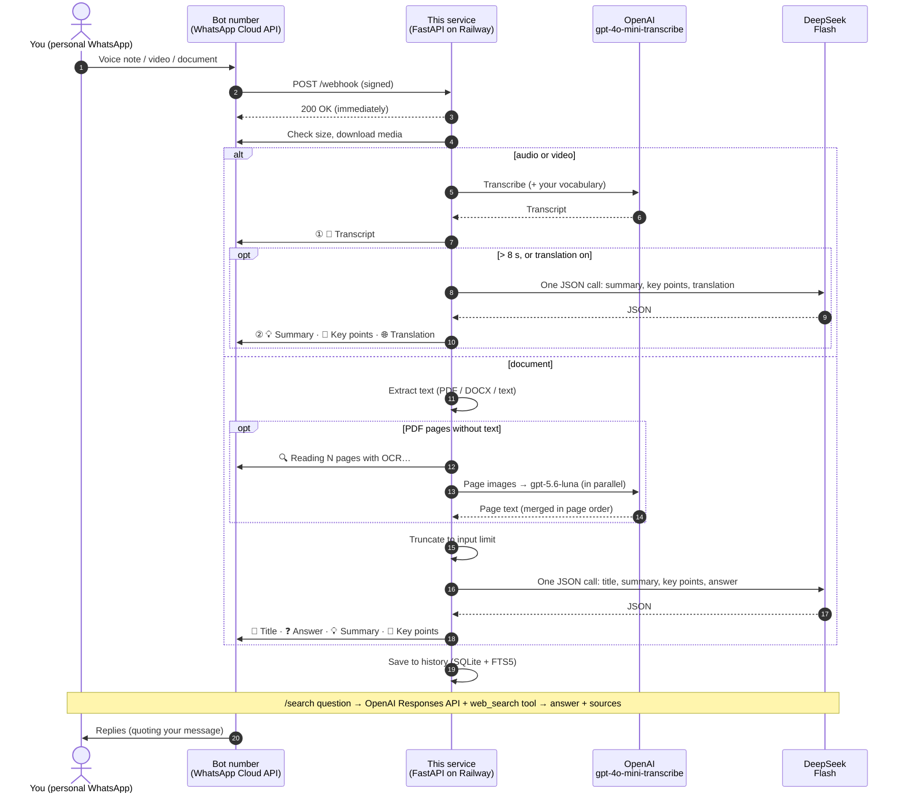

# Architecture

How messages flow through the service, the per-task token budgets, and the code layout.

[← Back to README](../README.md)

---

## 🧭 How it works



**Design notes**

- **Speed:**
  - The transcript goes out before any analysis starts.
  - All analysis happens in **one** DeepSeek call that returns JSON.
  - DeepSeek's thinking mode is **disabled**, since it's slower and burns output tokens on hidden reasoning.
- **OCR only when needed:**
  - A PDF page with fewer than 25 characters of extractable text is treated as scanned.
  - Only those pages are rendered (`pypdfium2`, longest side 1600 px) and sent to the vision model, 5 at a time.
  - Pages that already have text are never OCR'd, so normal PDFs cost nothing extra.
- **Audio length** is read from the file header (`mutagen`). If that fails, it's estimated from the transcript at about 2.5 words per second.
- **The bot is a separate number.** You message it like any contact. Never register your personal number as the bot, because it would stop working in the WhatsApp app.
- **Replies go out from the number that received the message**, taken from the webhook payload. A mistyped `WHATSAPP_PHONE_NUMBER_ID` can't break them.

## 🎯 Token budgets

Each task has its own output budget. Thinking is off, so the whole budget goes to the visible answer:

| Task | Output budget | Setting |
|---|---|---|
| Voice summary (1 sentence) | **150** tokens | `VOICE_SUMMARY_MAX_TOKENS` |
| Voice key points (3–5 bullets) | **+350** tokens | `VOICE_KEY_POINTS_MAX_TOKENS` |
| Voice translation | **≈ 1.5 × transcript tokens + 100**, capped at **4,000** | `TRANSLATION_MAX_TOKENS` |
| JSON overhead (voice) | **+50** tokens | — |
| Document title + summary + key points + answer | **1,500** tokens | `DOC_MAX_OUTPUT_TOKENS` |
| OCR, per page | **2,000** tokens (a dense A4 page is ~800–1,500) | `OCR_MAX_TOKENS_PER_PAGE` |
| Web search answer | **1,500** tokens, including light reasoning; the answer itself is ~120 words | `WEB_SEARCH_MAX_OUTPUT_TOKENS` |

And on the input side:

| Limit | Default | Setting |
|---|---|---|
| Document text sent to the model | **150,000 chars** (≈ 40k tokens); longer documents are truncated | `DOC_MAX_INPUT_CHARS` |
| Document file size | **20 MB** | `DOC_MAX_BYTES` |
| Audio/video file size | **25 MB** (OpenAI's upload limit) | `STT_MAX_BYTES` |
| Scanned pages OCR'd per document | **20** | `OCR_MAX_PAGES` |
| OCR image size | **1600 px** longest side (≈ 190 dpi on A4) | `OCR_IMAGE_MAX_SIDE` |

Examples: a 14 s note gets `50 + 150 = 200` tokens. A 95 s note with translation, whose transcript is about 1,200 characters, gets `50 + 150 + 350 + (400 × 1.5 + 100) = 1,250` tokens.

## 🗂️ Project structure

```text
.
├── app/
│   ├── main.py        # FastAPI app: webhook verify/receive, allow-list, dedupe, routing by message type
│   ├── pipeline.py    # Audio (two-stage reply) and document flows, reply formatting, cost/latency line
│   ├── ai.py          # OpenAI STT + OCR + web search, DeepSeek JSON analysis, per-task token budgets, cost from usage
│   ├── documents.py   # Text extraction: PDF (pypdf), Word (python-docx), plain text; scanned-page detection and rendering (pypdfium2)
│   ├── commands.py    # /help /search (web) /find (history) /lang /vocab /stats
│   ├── store.py       # SQLite history + FTS5 search + per-user preferences
│   ├── whatsapp.py    # Graph API: download (with size check), send (auto-split), signature check
│   ├── audio.py       # Audio duration from the file header (mutagen)
│   └── config.py      # All settings, from environment variables
├── tests/             # pytest: pipeline stages, budgets, documents, commands, routing, webhook
├── Dockerfile
├── .env.example
└── requirements*.txt
```

| Method | Path | Purpose |
|---|---|---|
| `GET` | `/health` | Liveness check → `{"ok": true}` |
| `GET` | `/webhook` | Meta's verification handshake |
| `POST` | `/webhook` | Incoming WhatsApp messages |

## 🔐 Security & privacy

- **Secrets stay out of git.** `.env` and `data/` are git-ignored, and the startup log prints secret **lengths** only.
- **Webhook signatures are checked** against `WHATSAPP_APP_SECRET` (`X-Hub-Signature-256`).
- **An allow-list protects your credits.** Strangers get no response.
- **Data flow:**
  - **Audio**, **scanned page images** and **`/search` questions** go to OpenAI.
  - **Transcripts and document text** go to DeepSeek, under each provider's data policy.
  - With `DB_PATH` set, transcripts, document text (up to the input limit) and summaries are stored in SQLite on your Railway volume. `/find` only returns the requesting user's own history.
  - Set `DB_PATH` empty to store nothing.
